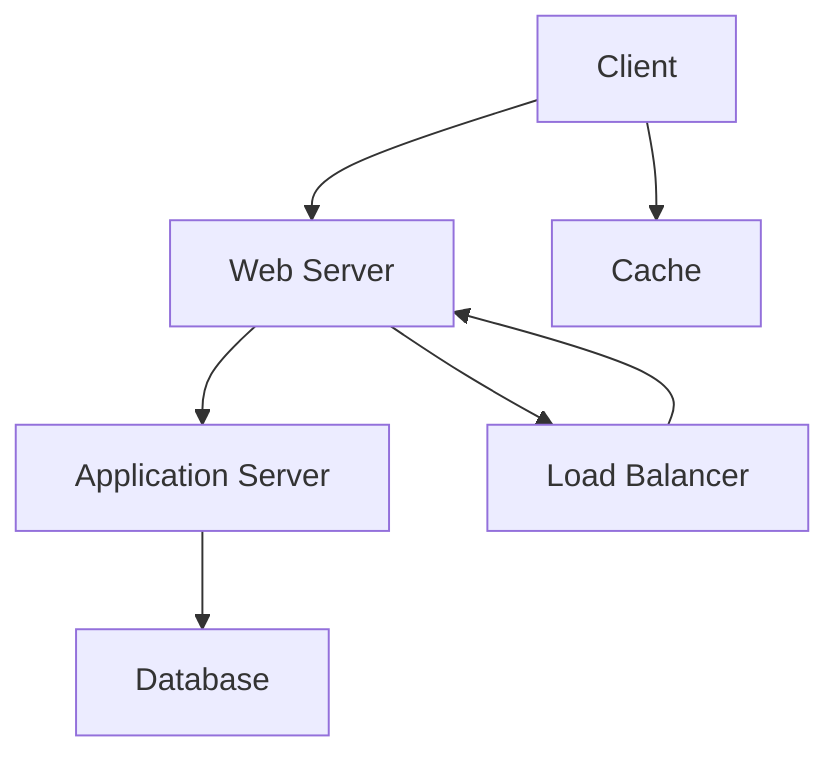

```mermaid
    graph TD;
        A[Client] --> B[Web Server];
        B --> C[Application Server];
        C --> D[Database];
        A --> E[Cache];
        B --> F[Load Balancer];
        F --> B;
```